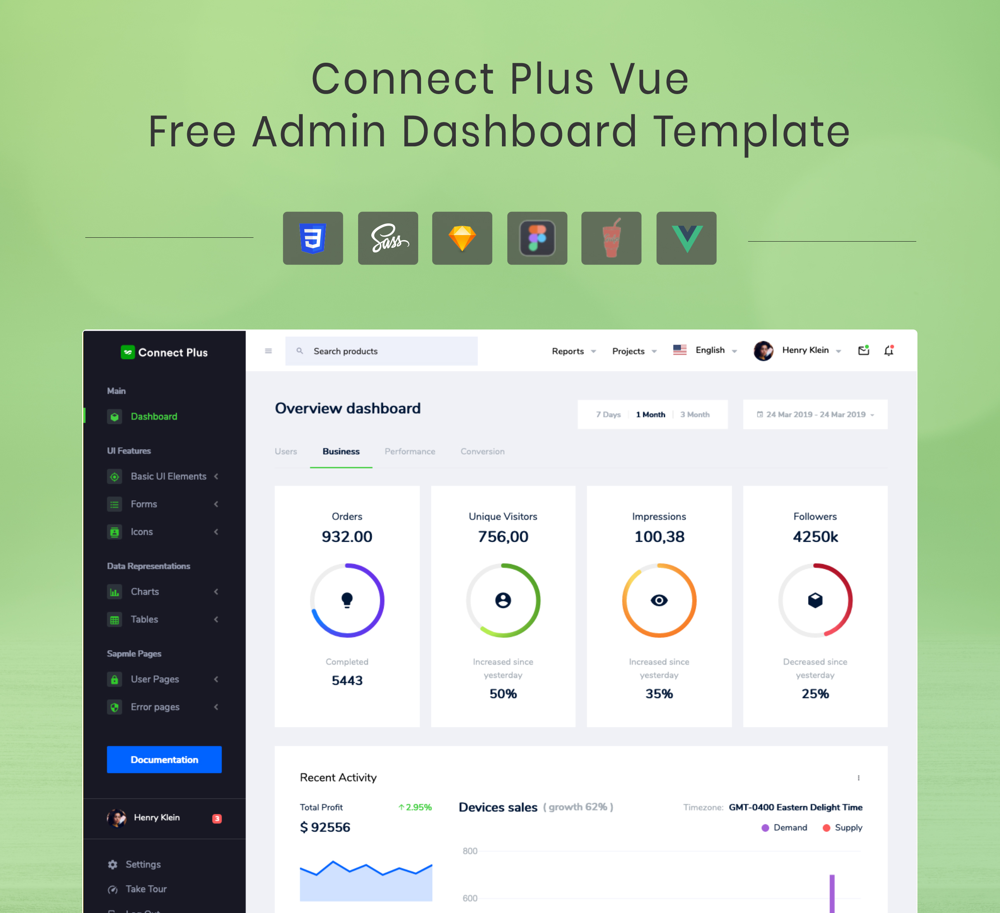

## Connect Plus Vue - Free Admin Template
Enjoy the free version of Connect Plus Vue Admin template. This is a powerful and lightweight teplate. It flaunts a neat, fresh, and unique design. Connect Plus puts a great focus on usability. It is highly customizable, and completely free to use. 

### Full Version
If you like this free template, check out the [full version of Connect Plus Vue](https://www.bootstrapdash.com/product/connect-plus-vue/)

### Demo
Click the image below to get a live preview.
[](https://bootstrapdash.com/demo/connect-plus-free-vue/preview/demo_1/)

### Documentation
Click [here](https://www.bootstrapdash.com/demo/connect-plus-free-vue/documentation/documentation.html) to check out the documentation

### Need support?
Report your issues with as many details as you can provide and we’ll try to get back to you as soon as possible.


### More from BootstrapDash

- [Star Admin Free Bootstrap Admin Template](https://github.com/BootstrapDash/StarAdmin-Free-Bootstrap-Admin-Template)
- [Purple Admin Free Admin Template](https://github.com/BootstrapDash/PurpleAdmin-Free-Admin-Template)
- [Majestic Admin Free Bootstrap Admin Template](https://github.com/BootstrapDash/MajesticAdmin-Free-Bootstrap-Admin-Template)


### Like what you see?
Please leave a star on our GitHub repo. Submit bugs and help us improve Connect Plus Vue! Find us on

- [Twitter](https://twitter.com/bootstrapdash?lang=en)
- [Facebook](https://www.facebook.com/bootstrapdash/)
- [Instagram](https://www.instagram.com/bootstrapdash/?hl=en)
- [Behance](https://www.behance.net/bootstrapdash)
- [Pinterest](https://www.pinterest.com/bootstrapdash/)
- [Dribbble](https://dribbble.com/bootstrapdash)
- [LinkedIn](https://in.linkedin.com/in/bootstrapdash)

Meticulously built at BootstrapDash. We hope you ❤ Connect Plus Vue!


### Additional Information:
#### Installation
##### What's included

Within the download you'll find the following directories and files, logically grouping common assets and providing both compiled and minified variations. You'll see something like this:

```
connect-plus-vue-free-admin-template/
  ├── template
    ├── demo_1
        ├── src/
            ├── app/
            ├── assets/
                ├── images/
                ├── styles/
            ├── index.js
        ├── public/
        ├── .gitignore
        ├── CHANGELOG.md
        ├── package.json
  ├── CHANGELOG.md
  ├── documentation
  ├── LICENSE
  ├── README.md
```


### Usage
##### clone the repo
$ git clone https://github.com/BootstrapDash/connect-plus-vue-free-admin-template.git

##### go into app's directory
$ cd connect-plus-vue-free-admin-template

##### install dependencies
npm install

##### serve with hot reload at localhost:8080
npm run dev

##### build for production with minification
npm run build

#### Advanced Options
##### build for production and view the bundle analyzer report
npm run build --report

##### run unit tests
npm run unit

##### run e2e tests
npm run e2e

##### run all tests
npm test For a detailed explanation on how things work, check out the guide and docs for vue-loader.


